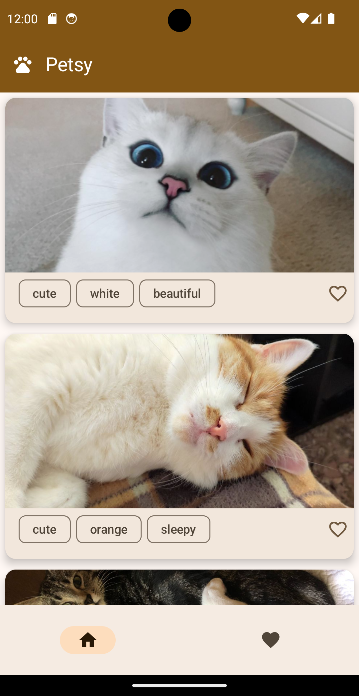
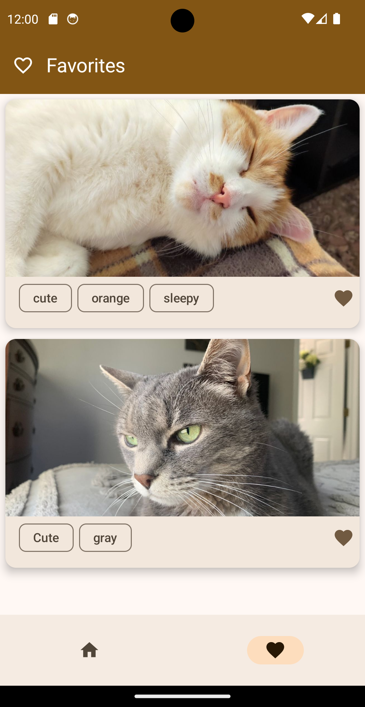
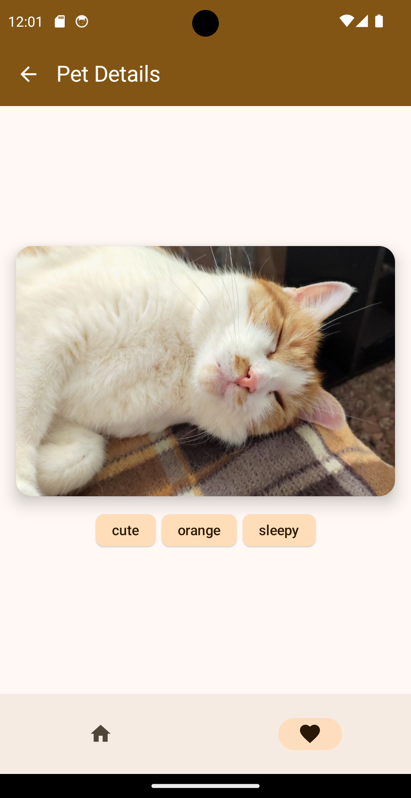
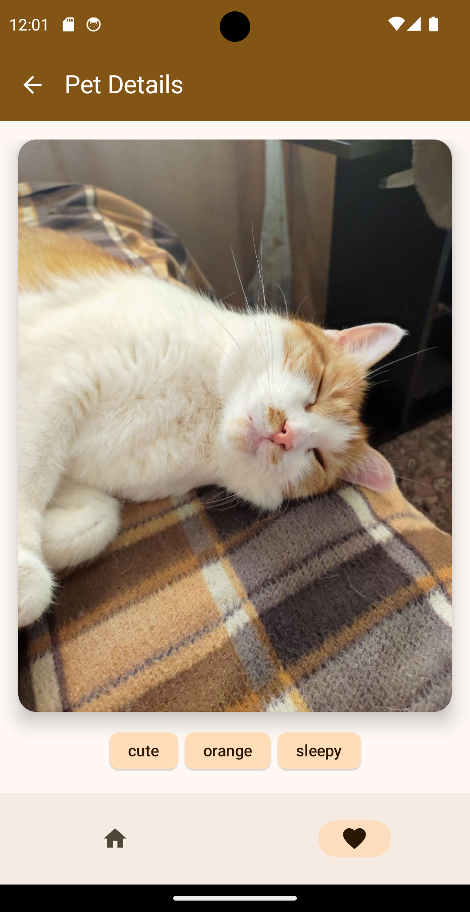
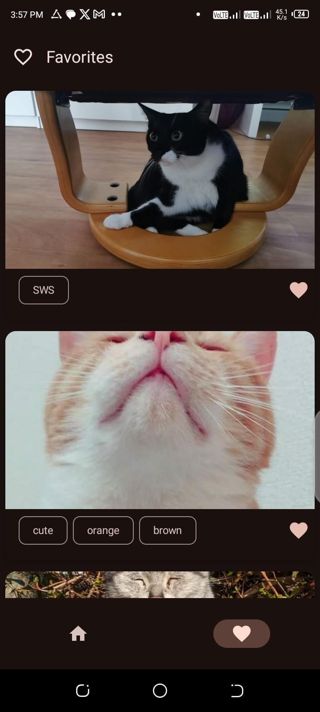
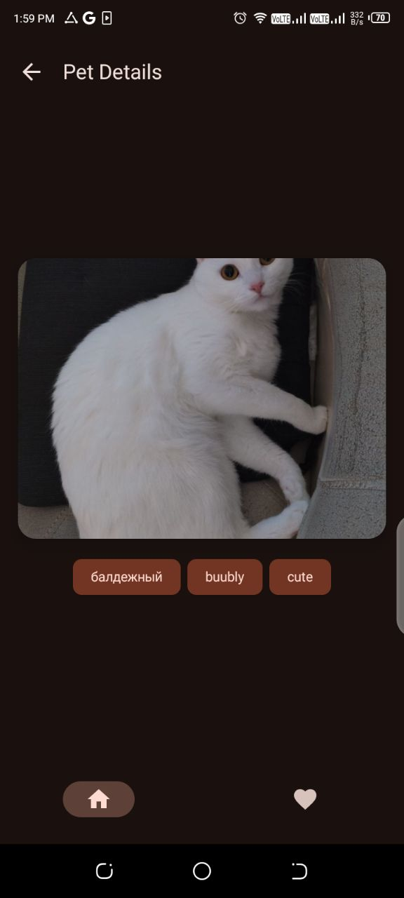
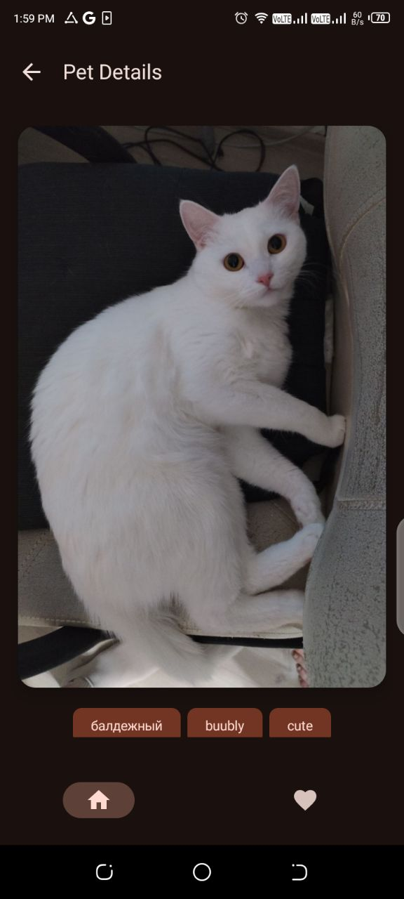

# PetApp
A simple Jetpack Compose App that consumes the Cat as a Service API
> The app is inspired by the concepts and ideas presented in [<b>Mastering Kotlin for Android 14</b>](https://www.amazon.com/Mastering-Kotlin-Android-14-libraries/dp/1837631719/ref=tmm_pap_swatch_0?link_from_packtlink=yes),
a book written by [<b>Harun Wangereka</b>](https://www.linkedin.com/in/harun-wangereka-442b37b9/)
##
## Screenshots
|     |   |  |  |
|:---------------------------------:|:-------------------------------:|:------------------------------:|:------------------------------:|
|  |  |  |  |

